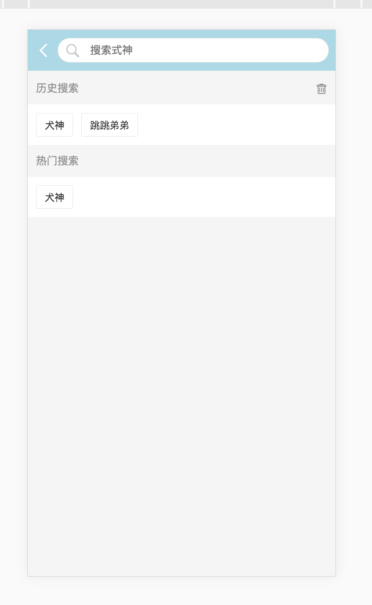

# yys_v2

> 阴阳师小助手第二版

## 效果图




## 基本
    - 构建工具：webpack；
    - 语言：Es6；
    - 代码规范：eslint
    - 应用：react，
           redux，
           react-router，
           ant-design，
           axios,
           immutable,

## Build Setup

``` bash
# install dependencies
npm install

# serve with hot reload at localhost:8080
npm run dev

# build for production with minification
npm run build
```
## [阴阳师小助手后端实现](https://github.com/funnycoderstar/yys-be)
- nodejs + crawler + koa2 + mongoose
